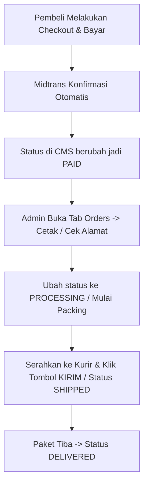

# 📘 Buku Panduan Penggunaan CMS Admin (Filament Panel)
**E-Commerce Modern — RadiantCode Platform**  
*Panduan Operasional Toko Online untuk Pengelola, Admin, dan Staf Gudang*

---

## 📋 Daftar Isi
1. [Cara Mengakses Admin Panel](#1-cara-mengakses-admin-panel)
2. [Tab 1: Dashboard (Pusat Kontrol & Analitik)](#2-tab-1-dashboard-pusat-kontrol--analitik)
3. [Tab 2: Manajemen Produk (Katalog Barang)](#3-tab-2-manajemen-produk-katalog-barang)
4. [Tab 3: Kategori Produk](#4-tab-3-kategori-produk)
5. [Tab 4: Manajemen Pesanan (Orders & Pembayaran)](#5-tab-4-manajemen-pesanan-orders--pembayaran)
6. [Tab 5: Ulasan & Testimoni Pelanggan (Reviews)](#6-tab-5-ulasan--testimoni-pelanggan-reviews)
7. [Tab 6: Manajemen Pengguna (Users & Admin)](#7-tab-6-manajemen-pengguna-users--admin)
8. [SOP Standar Pemrosesan Pesanan (Daily Workflow)](#8-sop-standar-pemrosesan-pesanan-daily-workflow)

---

## 1. Cara Mengakses Admin Panel

- **URL Akses:** `https://demo1-ecommerce.radiantcode.web.id/admin`
- **Login:** Masukkan Email dan Password Admin Anda.
- **Tampilan Antarmuka:**
  - **Sidebar Kiri:** Menu navigasi utama (Dashboard, Produk, Kategori, Pesanan, Ulasan, Pengguna).
  - **Area Tengah:** Area kerja tabel data dan form input.
  - **Header Kanan Atas:** Profil akun, tombol ganti mode Terang/Gelap (Light/Dark Theme), dan tombol Logout.

---

## 2. Tab 1: Dashboard (Pusat Kontrol & Analitik)

Dashboard adalah ringkasan performa toko online Anda yang diperbarui secara otomatis dan real-time:

### A. Kartu Metrik Ringkasan (Top KPI Cards)
1. **Total Pendapatan (Rp)**: Akumulasi nilai uang dari seluruh transaksi yang berstatus **Lunas (Paid, Processing, Shipped, Delivered)**. Terdapat grafik tren mini (*sparkline*) 7 hari terakhir.
2. **Pesanan Menunggu**: Jumlah pesanan baru yang masuk dan belum diproses/menunggu konfirmasi atau pembayaran.
3. **Total Pesanan**: Total keseluruhan transaksi yang pernah terjadi di toko.
4. **Katalog Produk Aktif**: Jumlah produk yang sedang tayang dan aktif dijual di etalase pembeli.

### B. Grafik Tren Penjualan (7 Hari Terakhir)
- Memetakan omset harian (garis biru) vs jumlah transaksi harian (garis hijau).
- Membantu Anda melihat hari-hari puncak penjualan (*peak sales days*).

### C. Tabel Pesanan Terbaru
- Menampilkan 5 transaksi paling mutakhir yang baru saja masuk lengkap dengan status pembayaran dan tombol akses cepat untuk melihat detail pesanan.

---

## 3. Tab 2: Manajemen Produk (Katalog Barang)

Menu ini digunakan untuk menambah barang baru, mengubah stok/harga, mengupload foto/video, serta mengatur variasi produk (warna/ukuran).

### A. Informasi Utama Produk
- **Nama Produk**: Nama barang yang menarik pembeli (contoh: *Anker Soundcore Space One ANC*).
- **URL Slug**: Tautan web produk (terisi otomatis dari nama, atau bisa dikustomisasi untuk SEO).
- **Kode SKU / Barcode**: Kode identifikasi stok toko (contoh: *ANK-SP-001*). Jika dikosongkan, sistem akan membuatkan kode unik otomatis.
- **Kategori Produk**: Pilih kategori tempat produk ini bernaung.
- **Deskripsi Singkat**: Ringkasan 1-2 kalimat pemikat yang muncul di bawah judul produk.
- **Deskripsi Lengkap (Rich Editor)**: Penjelasan lengkap fitur, keunggulan produk. Mendukung pemformatan teks tebal, poin-poin (*bullet points*), dan bisa menyisipkan gambar/banner langsung di dalam teks.
- **Spesifikasi Teknis Produk**: Fitur tabel dinamis (Key-Value). Masukkan parameter (misal: *Koneksi, Garansi, Daya Tahan Baterai*) dan nilainya (misal: *Bluetooth 5.3, 18 Bulan, 40 Jam*). Ini akan otomatis muncul sebagai tabel rapi di halaman pembeli.

### B. Harga & Inventaris (Kolom Kanan)
- **Harga Normal**: Harga jual standar barang (contoh: `1299000`).
- **Harga Coret / Promo**: Kosongkan jika harga normal. Jika diisi lebih rendah dari harga normal, sistem toko akan otomatis menampilkan label diskon (misal: *Diskon 25%*) dan mencoret harga asli.
- **Jumlah Stok**: Jumlah sisa barang di gudang. Otomatis berkurang saat ada transaksi lunas.
- **Berat (Gram)**: Berat barang dalam gram (contoh: `500` untuk 0.5 kg). Berguna untuk kalkulasi ongkir.
- **Aktifkan di Toko**: Jika dinonaktifkan, produk disembunyikan sementara tanpa menghapus datanya.
- **Produk Unggulan (Featured)**: Jika dicentang, produk akan muncul di banner/bagian depan rekomendasi utama homepage.

### C. Video Showcase Produk (Fitur Unggulan)
Toko Anda mendukung penayangan video produk yang memukau:
- **Metode Video**: Pilih **Upload File Video** (MP4/MOV/WEBM s/d 100 MB) atau **URL Video Online**.
- Video ini akan menjadi media sorotan pertama saat calon pembeli membuka halaman produk.

### D. Galeri Media Produk (Foto & Video Tambahan)
- Anda bisa menambahkan banyak foto/video produk.
- **Gambar Utama (Thumbnail)**: Centang salah satu foto untuk dijadikan cover etalase depan.
- **Urutan Tampilan**: Tentukan urutan ke-1, 2, 3 sesuai keinginan. Bisa di-drag & drop untuk mengurutkan.

### E. Variasi Produk (Warna / Ukuran / Model)
Jika produk memiliki opsi (misal: Warna Hitam, Putih, Biru atau Ukuran S, M, L, XL):
- Tambahkan item variasi di bagian **Variasi Produk**.
- Masukkan: Nama Variasi, Stok Variasi, SKU khusus, Tambahan/Perubahan Harga jika ada, dan Foto thumbnail khusus varian tersebut.

---

## 4. Tab 3: Kategori Produk

Digunakan untuk merapikan kelompok etalase barang (contoh: *Audio, Aksesoris Gadget, Smartwatch, Laptop*).

- **Nama Kategori**: Nama kategori yang akan muncul di menu navigasi toko.
- **Slug URL**: Terisi otomatis.
- **Deskripsi Kategori**: Keterangan singkat kategori.
- **Banner Kategori**: Upload foto banner atau cantumkan URL gambar untuk mempercantik halaman kategori.

---

## 5. Tab 4: Manajemen Pesanan (Orders & Pembayaran)

Pusat operasional utama harian (*daily operations*) untuk mengecek pembelian, mengecek verifikasi pembayaran Midtrans, dan pengiriman pesanan.

### A. Tabel Daftar Pesanan
- **No. Pesanan**: Kode unik pesanan (misal: `ORD-20260916-0001`). Bisa diklik untuk menyalin instan.
- **Penerima & Kontak**: Nama pembeli dan nomor WhatsApp aktif.
- **Total Tagihan**: Total rupiah yang harus/sudah dibayar.
- **Status Pesanan**:
  - 🟡 **Pending**: Menunggu pembayaran dari pembeli.
  - 🟢 **Paid**: Pembeli sudah berhasil bayar (terkonfirmasi oleh Midtrans).
  - 🔵 **Processing**: Sedang disiapkan/dikemas oleh staf gudang.
  - 🟣 **Shipped**: Paket telah diserahkan ke kurir pengiriman.
  - 🟢 **Delivered**: Paket telah sampai di tujuan dan diterima pembeli.
  - 🔴 **Cancelled**: Pesanan dibatalkan atau kadaluarsa (*expired*).
- **Metode Bayar**: Menampilkan metode yang dipilih pembeli (misal: `qris`, `bank_transfer`, `gopay`).
- **Tombol Aksi Cepat "Kirim"**: Tombol berikon truk untuk langsung mengubah status pesanan dari *Paid/Processing* menjadi *Shipped* hanya dengan 1 klik konfirmasi.

### B. Halaman Detail Pesanan
Saat Anda mengklik salah satu pesanan:
1. **Daftar Produk yang Dipesan**: Menampilkan rincian foto barang, nama produk, varian yang dipilih, jumlah (qty), harga satuan, dan subtotal.
2. **Kotak Status Gateway Midtrans**:
   - Status settlement resmi dari Midtrans.
   - Metode bayar & nominal yang masuk.
   - **ID Transaksi Midtrans**: Kode resmi transaksi bank/gateway yang bisa dicocokkan langsung dengan dashboard Midtrans Merchant Anda.
3. **Data Tujuan & Penerima Pengiriman**:
   - Nama lengkap penerima.
   - Nomor HP/WhatsApp (bisa langsung dihubungi untuk konfirmasi alamat).
   - Kota/Kabupaten & Kode Pos.
   - Alamat lengkap pengiriman.
   - Catatan khusus dari pembeli (contoh: *"Tolong bungkus bubble wrap tebal"*).

---

## 6. Tab 5: Ulasan & Testimoni Pelanggan (Reviews)

Fitur untuk memantau dan memoderasi ulasan yang diberikan pembeli setelah berbelanja:
- **Produk**: Barang yang diulas.
- **Pelanggan**: Nama akun yang memberikan testimoni.
- **Rating Bintang**: Skor bintang 1 sampai 5.
- **Komentar Pembeli**: Isi testimoni dan kepuasan pembeli.
- **Moderasi / Hapus**: Anda dapat menghapus ulasan yang mengandung kata-kata tidak pantas atau spam agar etalase toko tetap kredibel.

---

## 7. Tab 6: Manajemen Pengguna (Users & Admin)

Mengelola seluruh akun yang terdaftar di platform:
- **Filter Peran**: Memisahkan antara **Administrator** (staf/pemilik toko) dan **Customer** (pembeli biasa).
- **Informasi Akun**: Nama lengkap, alamat email, no. HP/WhatsApp, foto avatar, dan riwayat jumlah order yang pernah dilakukan pelanggan tersebut.
- **Menambah Admin Baru**: Anda bisa mendaftarkan rekan kerja/staf gudang baru dengan peran `Admin` agar mereka memiliki akses ke CMS Filament.

---

## 8. SOP Standar Pemrosesan Pesanan (Daily Workflow)

Alur kerja harian yang direkomendasikan untuk admin toko:

1. **Pagi & Siang Hari**: Buka tab **Orders**, gunakan filter status `Paid` untuk melihat pesanan lunas yang siap dikemas.
2. **Kemas Barang**: Buka detail pesanan, siapkan barang sesuai **Daftar Produk yang Dipesan** dan alamat yang tertera.
3. **Kirim Barang**: Saat kurir menjemput paket, klik tombol **Kirim** (ikon truk) di baris pesanan atau ubah status ke `Shipped`.
4. **Update Stok**: Jika ada barang baru masuk dari supplier, langsung perbarui stok di tab **Products**.
